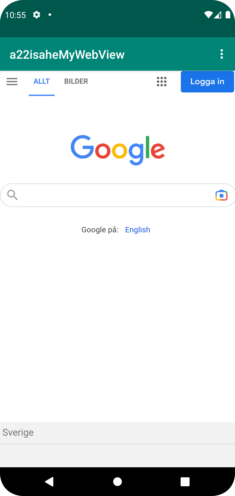

# Rapport

mobileapp-programming-webview a22isahe

Jag andrade strängen app_name i res/values/strings.xml till a22isaheMyWebView för att byta namn på
appen. appen fick tillgång till internet genom följande kod i AndroidManifest.xml:

```
  <uses-permission android:name="android.permission.INTERNET"/>
```

Ett WebView-element skapades i activity_main.xml och gavs ett id: "android:id="@+id/my_webView". en
webview variabel deklarerades och initierades i MainActivity.java. En webviewClient lades till och javascript aktiverades.

```
    private WebView myWebView; // Först i mainactivity klassen
    
    protected void onCreate(Bundle savedInstanceState) {
    
        super.onCreate(savedInstanceState);
        setContentView(R.layout.activity_main);
        Toolbar toolbar = findViewById(R.id.toolbar);
        setSupportActionBar(toolbar);
        myWebView = findViewById(R.id.my_webView); //Använder id för att visa Webview elementet som specifierats i activity_main.xml
        myWebView.setWebViewClient(new WebViewClient());
        myWebView.getSettings().setJavaScriptEnabled(true);
    }
    
```
en Html-fil skapades : assets/aboutPage.html
I MainActivity.java lades kod till för att visa html sidan och en url länk. Detta gjordes med dessa metoder:
```
public void showExternalWebPage() {
        // TODO: Add your code for showing external web page here
        myWebView.loadUrl("https://google.com");
    }

    public void showInternalWebPage() {
        // TODO: Add your code for showing internal web page here
       myWebView.loadUrl("file:///android_asset/aboutPage.html");
    }
``` 
Sist kallades metoderna eventhanteraren onOptionsItemSelected som agerar på knapptryck i hamburgarmenyn
```
public boolean onOptionsItemSelected(MenuItem item) {
        // Handle action bar item clicks here. The action bar will
        // automatically handle clicks on the Home/Up button, so long
        // as you specify a parent activity in AndroidManifest.xml.
        int id = item.getItemId();

        //noinspection SimplifiableIfStatement
        if (id == R.id.action_external_web) {
            Log.d("==>", "Will display external web page");
            showExternalWebPage();                              //visar Externa sidan
            return true;
        }

        if (id == R.id.action_internal_web) {
            Log.d("==>", "Will display internal web page");
            showInternalWebPage();                              //visar Interna Html-sidan
            return true;
        }

        return super.onOptionsItemSelected(item);
    }
```

Screenshots på den färdiga appens externa sida och interna sida:




